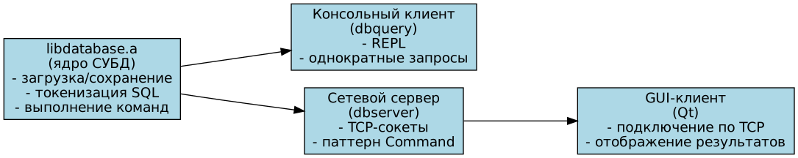
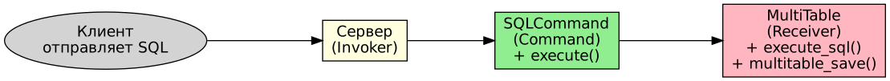
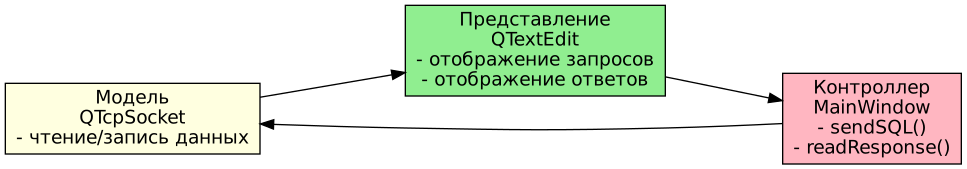
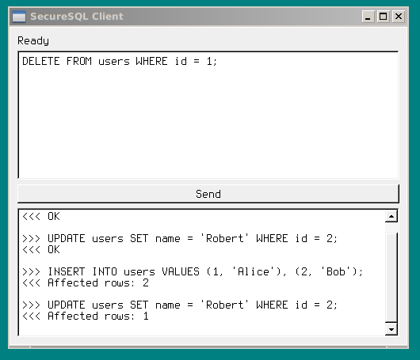

= Проект собственной СУБД

== Введение

**Цель работы**: разработать легковесную реляционную СУБД с поддержкой базового SQL, сетевым взаимодействием и графическим интерфейсом.

**Особенности проекта**:

- Компактность: ~800 строк кода основной логики, ~1700 вместе с GUI и сервером.
- CLI не требует сторонних библиотек, подходит для использования в цепочках команд.
- Поддержка TCP-сервера и Qt-клиента.

== Архитектура системы

=== Общая схема

*Ядро* реализует загрузку/сохранение таблиц, токенизацию SQL, парсинг и выполнение команд.

*Консольный клиент* (`main.cpp`) поддерживает REPL и однократное выполнение запросов.

*Сетевой сервер* (`server.cpp`) использует сокеты и паттерн Command.

*GUI-клиент* (`qt_client/`) написан на Qt5/Qt6, подключается к серверу по TCP.

=== Формат хранения

Данные хранятся в CSV-подобном формате:

....
"users"
"id:INT","name:TEXT"
"1","Alice"
"2","Bob"
....

Первая строка – имя таблицы в кавычках. Вторая – схема: `"колонка:TYPE"`. Далее строки данных.

== Паттерны проектирования

=== Command (основной)

Инкапсулирует SQL-запрос в объект, что позволяет отделить запрос от выполнения.

Фрагмент реализации (`server.cpp`):

[source,cpp]
....
class SQLCommand {
    MultiTable* mt;
    std::string sql;
    std::string result;
public:
    void execute() {
        int affected = execute_sql(mt, sql.c_str(), stream);
        // ...
    }
};
....

Почему выбран: легко добавлять новые команды, естественно для сетевого взаимодействия (запрос приходит как строка).

=== MVC (GUI-клиент)

== Детали реализации

=== Грамматика SQL (BNF)

[source,ebnf]
....
<select> ::= "SELECT" ("*" | <column-list>) "FROM" <table-name> ["WHERE" <condition>] ";"
<insert> ::= "INSERT" "INTO" <table-name> ["(" <column-list> ")"] "VALUES" <values-list> ";"
<update> ::= "UPDATE" ["TABLE"] <table-name> "SET" <assignment-list> ["WHERE" <condition>] ";"
<delete> ::= "DELETE" "FROM" <table-name> ["WHERE" <condition>] ";"
<condition> ::= <column-name> <comp-op> <value>
              | <condition> "AND" <condition>
              | <condition> "OR" <condition>
              | "NOT" <condition>
              | "(" <condition> ")"
....

=== Токенизация и парсинг

Ручной лексер разбивает строку на токены, обрабатывая строки в кавычках и операторы сравнения:

[source,cpp]
....
static int tokenize(const char *s, Tokens *out) {
    while (*p) {
        if (*p == '\'') { /* строковая константа */ }
        else if (ispunctchar(*p)) { /* операторы */ }
        else { /* идентификаторы */ }
    }
}
....

=== Обработка условий

Рекурсивный спуск для `AND`, `OR`, `NOT` и скобок:

[source,cpp]
....
static int eval_expr(const Table *t, int row, const Tokens *tok, int *pos) {
    int left = eval_primary(t, row, tok, pos);
    while (*pos < tok->n) {
        if (strcasecmp(tok->tokens[*pos], "AND") == 0) { /* ... */ }
        else if (strcasecmp(tok->tokens[*pos], "OR") == 0) { /* ... */ }
        else break;
    }
    return left;
}
....

=== Типы данных

Поддерживаются `INT`, `FLOAT`, `BOOL`, `TEXT`, `VARCHAR(n)`.

[source,cpp]
....
static int validate_value(const char *val, int type) {
    switch (type) {
        case TYPE_INT:
            strtol(val, &endptr, 10);
            return *endptr == '\0';
        case TYPE_FLOAT:
            strtod(val, &endptr);
            return *endptr == '\0';
        // ...
    }
}
....

== Интерфейс пользователя

=== Консольный клиент

[source,bash]
....
# Однократное выполнение
./build/dbquery data.csv "SELECT * FROM users;" output.csv

# Интерактивный режим
./build/dbquery data.csv
SecureSQL> CREATE TABLE users (id INT, name TEXT);
SecureSQL> INSERT INTO users VALUES (1, 'Alice');
Affected rows: 1
SecureSQL> SELECT * FROM users;
id,name
1,Alice
SecureSQL> exit
....

=== GUI-клиент

Пример работы:

- В верхнем поле вводится SQL-запрос.
- По нажатию `Send` запрос отправляется серверу.
- Ответ отображается в нижнем поле.

Запуск GUI:
[source,bash]
....
./qt_client/dbclient --port 54321
....

== Сборка и установка

`build.sh` автоматически:

. Определяет ОС и пакетный менеджер.
. Устанавливает `make`, `g++`, Qt (при необходимости).
. Запускает `make`.

Основные цели `Makefile`:

[source,make]
....
all          # сборка библиотеки, сервера, консольного и GUI-клиента
clean        # удаление артефактов сборки
test         # тесты консольного клиента
test_server  # тесты сервера через netcat
....

== Тестирование

=== Консольные тесты (`test.sh`)

Проверяют:

- базовые DDL/DML (CREATE, INSERT, SELECT, DELETE, DROP)
- множественный INSERT
- UPDATE с WHERE и без
- сложные условия WHERE (AND, OR, NOT, сравнения)
- CREATE/DROP DATABASE
- типы данных и проверку значений
- явный список столбцов в INSERT

=== Серверные тесты (`test_server.sh`)

Запускают сервер, подключаются через `netcat`, выполняют SQL и проверяют ответы.

Пример вывода:
[source,bash]
....
Тестирование сервера:
  PASS: CREATE TABLE
  PASS: INSERT
  PASS: SELECT
  PASS: UPDATE
  PASS: DELETE
  PASS: DROP TABLE
=== All server tests passed ===
....

== Заключение

*Реализовано*:

- все DDL и DML из MVP
- поддержка типов данных
- сложные условия WHERE
- консольный клиент с REPL
- сетевая версия (сервер + клиент)
- GUI-клиент на Qt
- паттерн Command
- автоустановка зависимостей
- полное тестирование

== Приложение

=== Структура проекта

....
.
├── build.sh                 # установка зависимостей и сборка
├── run.sh                   # быстрый запуск консольного клиента
├── Makefile                 # сборка через make
├── database.cpp / .hpp      # ядро СУБД
├── main.cpp                 # консольный клиент
├── server.cpp               # сетевой сервер
├── qt_client/               # GUI-клиент на Qt
│   ├── mainwindow.hpp/.cpp
│   ├── main.cpp
│   └── qt_client.pro
├── test.sh                  # тесты консольного клиента
├── test_server.sh           # тесты сервера
└── README.md
....

=== Ключевые цитаты из кода

Выполнение SQL (`database.cpp`):

[source,cpp]
....
int execute_sql(MultiTable *mt, const char *sql, FILE *out) {
    Tokens tok;
    tokenize(sql, &tok);
    if (strcasecmp(tok.tokens[0], "SELECT") == 0) result = do_select(...);
    else if (strcasecmp(tok.tokens[0], "INSERT") == 0) result = do_insert(...);
    // ...
}
....

Паттерн Command на сервере (`server.cpp`):

[source,cpp]
....
class SQLCommand {
    void execute() {
        execute_sql(mt, sql.c_str(), stream);
        multitable_save(mt, db_path);
    }
};
....
